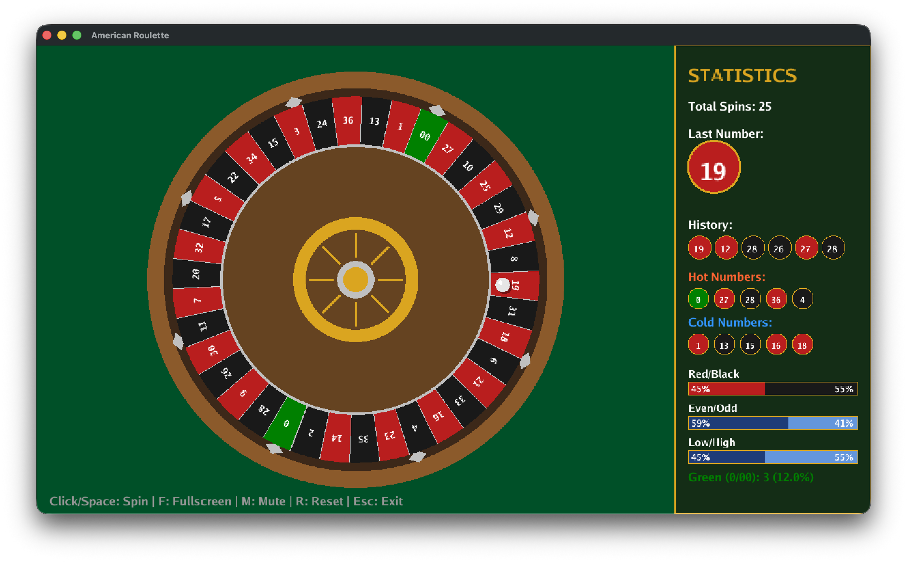

# American Roulette Wheel

A fullscreen American roulette wheel application built with Go and Ebitengine for casino night events.



## Features

- Authentic 38-slot American wheel with correct number placement
- Physics-based ball animation with bouncing and settling
- Statistics panel (history, hot/cold numbers, percentages)
- Programmatically generated sound effects
- Fullscreen support

## Build

Requires Go 1.21+. Linux needs [Ebitengine dependencies](https://ebitengine.org/en/documents/install.html).

```bash
go mod tidy
go build -o roulette-wheel .
./roulette-wheel
```

## Controls

| Key | Action |
|-----|--------|
| Click / Space / Enter | Spin the wheel |
| F / F11 | Toggle fullscreen |
| M | Toggle mute |
| R | Reset statistics |
| Escape | Exit fullscreen / Exit application |

## License

See LICENSE file for details.
